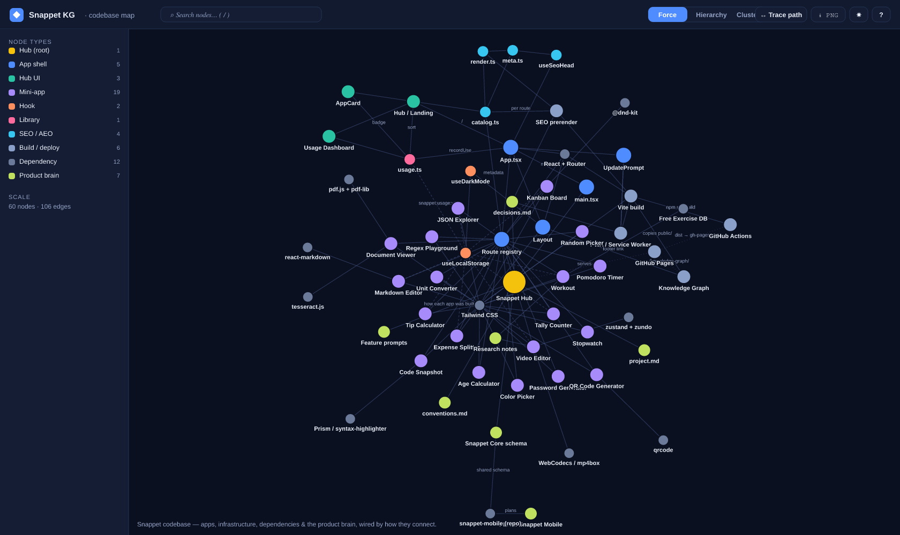
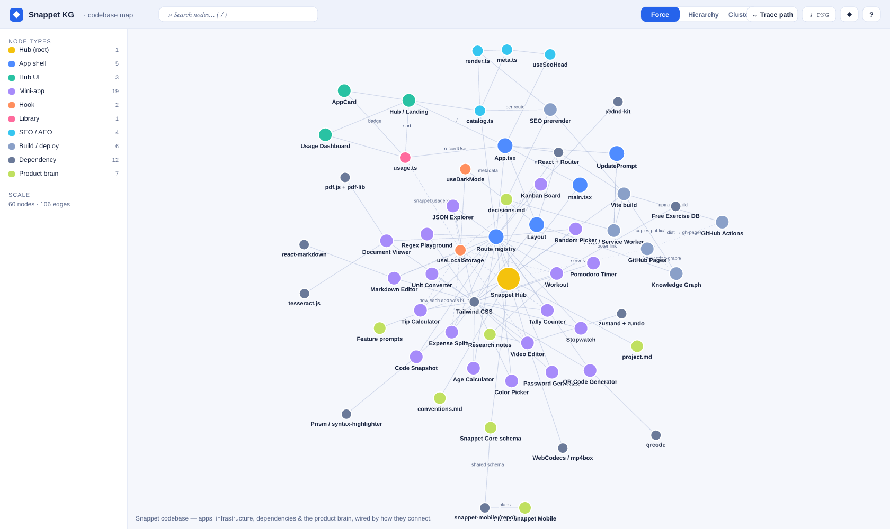

# Snappet — Documentation

Documentation hub for the Snappet web app. For the project overview, the full tool list, and
getting-started instructions, see the [root README](../README.md).

- **Live app:** https://harshal2802.github.io/Snappet/
- **Knowledge graph:** https://harshal2802.github.io/Snappet/knowledge-graph/

## Contents

- [Knowledge graph](#knowledge-graph) — the hostable, interactive codebase map
- [Architecture](#architecture) — how the pieces fit together
- [Data & privacy](#data--privacy)
- [SEO / AEO](#seo--aeo)
- [PWA & offline](#pwa--offline)
- [Where to read more](#where-to-read-more)

---

## Knowledge graph

An interactive, dependency-free visualization of the **entire repository** — every mini-app,
shared hook, build step, third-party dependency, and product-brain doc, wired by the relationships
that connect them. It's a single static page (plain HTML/CSS/JS), so it works offline and deploys
with the app at `/Snappet/knowledge-graph/`.

### Dark



### Light



**Features:** Force / Hierarchy / Cluster layouts · fuzzy search (`/`) · click-to-focus with a
neighbor detail panel · shortest-path tracing between any two nodes · type/category/layer filters ·
zoom, pan, drag · deep-links (`?node=<id>`) · PNG export · light/dark theme.

**Source & data model:** [`src/frontend/public/knowledge-graph/`](../src/frontend/public/knowledge-graph/)
([README](../src/frontend/public/knowledge-graph/README.md)). The model is a single
[`data.js`](../src/frontend/public/knowledge-graph/data.js) file of nodes + edges.

### Regenerating the screenshots

The PNGs in [`screenshots/`](screenshots/) are rendered from the same `data.js` the live page uses,
so they never drift from the real model:

```bash
# one-off render tool (not a runtime dependency)
npm --prefix src/frontend install --no-save @resvg/resvg-js
node scripts/render-knowledge-graph.mjs
# → docs/screenshots/knowledge-graph.png  (dark)
# → docs/screenshots/knowledge-graph-light.png  (light)
```

If `@resvg/resvg-js` isn't installed, the script writes the `.svg` instead and skips
rasterization — the committed PNGs stay valid until the model changes.

## Architecture

```
                       ┌──────────────────────────────────────────┐
   GitHub Actions ───▶ │  Vite build  (tsc + bundle + prerender)   │ ───▶ gh-pages ─▶ GitHub Pages
   (push to main)      │   • SEO prerender plugin (per-route HTML)  │
                       │   • vite-plugin-pwa (offline service worker)│
                       │   • copies public/ (incl. knowledge-graph) │
                       └──────────────────────────────────────────┘

   Runtime (in the browser):

     main.tsx → <App> ─┬─ Layout (header, dark-mode toggle, footer → knowledge graph)
                       ├─ useSeoHead   ← seo/meta ← seo/catalog  (single source of truth)
                       ├─ lib/usage    → localStorage (per-device open counts)
                       └─ Routes ──────┬─ Hub (search · filter · sort · usage dashboard)
                                       └─ 20 lazily-loaded mini-apps
                                            └─ useLocalStorage (snappet:<app>:<field>)
```

- **`seo/catalog.ts`** is the single source of truth for tool metadata. The route registry, runtime
  `<head>` management, and the build-time prerenderer all read from it — so they can never drift.
- **`lib/usage.ts`** records per-device "opens" in `localStorage` (`snappet:usage:v1`). This powers
  the hub's popularity sort and the usage dashboard. It never leaves the browser.
- **`hooks/useLocalStorage.ts`** is the persistence backbone every tool uses.
- Each mini-app is a self-contained folder under `src/frontend/apps/<slug>/`, lazy-loaded by route.

## Data & privacy

Snappet has **no backend, no accounts, and no analytics**. Everything runs in the browser. The only
state that persists is your own preferences and tool data, stored in `localStorage` under
`snappet:*` keys and cleared by each tool's `↺ Reset` or by clearing site data. Files you open
(Document Viewer, Video Editor) are processed entirely on-device and are never uploaded.

## SEO / AEO

The Vite build's prerender plugin writes one static HTML file per route with a unique
title/description/canonical, Open Graph/Twitter tags, JSON-LD, and crawlable body content — plus
`sitemap.xml`, `robots.txt`, and an `llms.txt` index — so the SPA is discoverable by both search
engines and AI crawlers. See [`pdd/context/research/seo-aeo.md`](../pdd/context/research/seo-aeo.md).

## PWA & offline

Built with `vite-plugin-pwa` (Workbox `generateSW`): the app shell, hashed JS/CSS chunks, icons, and
the knowledge graph are precached, with `index.html` as the SPA navigation fallback. An in-app
"Update available" banner (`UpdatePrompt`) appears when a new version ships. See the
`[2026-05-27] PWA` entry in [`decisions.md`](../pdd/context/decisions.md).

## Where to read more

| Topic | File |
|---|---|
| Project brief, stack, current state | [`pdd/context/project.md`](../pdd/context/project.md) |
| Coding conventions | [`pdd/context/conventions.md`](../pdd/context/conventions.md) |
| Technical decisions (the *why*) | [`pdd/context/decisions.md`](../pdd/context/decisions.md) |
| Feature research | [`pdd/context/research/`](../pdd/context/research/) |
| Per-feature prompt chains | [`pdd/prompts/features/`](../pdd/prompts/features/) |
| Shared native/web data schema | [`pdd/context/snappet-core-schema.md`](../pdd/context/snappet-core-schema.md) |
| Knowledge graph internals | [`src/frontend/public/knowledge-graph/README.md`](../src/frontend/public/knowledge-graph/README.md) |
